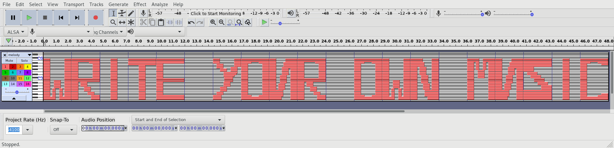

# A Picture is a Thousand Words — 10

> Apparently there is something hidden in this [image](image.jpg)...
>
> Hint: You’re looking for text—how might you look at the text of the image?

`strings` or `exiftool` can do the job.

```bash
» exiftool image.jpg | grep -i flag
Artist                          : flag_is_DjKVIXXQRZZrrAd
```

# Straight From the Emperor — 10

> The Emperor says `ny_nx_tsq3_zumnqq_kwtr_mjwj_6895967bde` –what could it
> possibly mean? I hear that he 'encrypts' numbers now too, something
> about appending them to the alphabet...
>
> Hint: Some say he’s an emperor, I say he’s a salad.

As the hint makes obvious, this is a caesar cipher with a custom alphabet
`a-z0-9`.

```python
import string
def caesar(plaintext, shift):
    alphabet = string.ascii_lowercase + string.digits
    shifted_alphabet = alphabet[shift:] + alphabet[:shift]
    table = string.maketrans(alphabet, shifted_alphabet)
    return plaintext.translate(table)

>>> caesar('ny_nx_tsq3_zumnqq_kwtr_mjwj_6895967bde', -5)
'it_is_only_uphill_from_here_1340412689'
```

# Caesar Cipher? — 20

> “Cowards die many times before their deaths; the valiant only taste of
> death but once.” (1007, 1008) Are you valiant enough to figure this out?
>
> `5:6 1139:4 1620:3 172:4`
>
> Hint: There's a lot of text on the Internet and in print. What if you
> could send messages using all of that data? But you’d have to pick
> something pretty famous...

Googling the quote confirms that it is from Shakespeare's play "The
Tragedy of Julius Caesar." `1007` and `1008` refer to the lines in the
transcript where the quote was said. My first interpretation of the
cipher is each group is of the form `line:character`.

```
line 5:     Upon a labouring day without the sign
line 1139:  Stay not to answer me, but get thee gone:
line 1620:  The good is oft interred with their bones;
line 172:   I would not, Cassius; yet I love him well.

Guess:      ayeo
```

That is wrong, however, the pairs are actual referencing `line:word`.

```
the answer is Cassius
```

There we have our flag, `Cassius`.


# Let Me In — 20
> You received this [account.rar](account.rar) file, but it is 'protected'
> under a password. Can you break in?
>
> Hint: Something tells me the user might not be using complex passwords...

Before pulling out `john`, let's try the most secure password I know.

```bash
» echo 123456 | unrar p account.rar

UNRAR 5.60 beta 3 freeware      Copyright (c) 1993-2018 Alexander Roshal


Extracting from account.rar

------ Printing flag.txt

  39%rgSueiMYehWJSZPZr

All OK
```

# Go Git It — 25
> The code samurai (also known by his pseudonym Nicholas) was making some
> final optimizations on his program when... he accidentally decapitated it.
>
> Download the samurai’s repository: [go git it.tar.bz2](go_git_it.tar.bz2)
>
> Hint: Perhaps 'chopping a branch off a tree' would be the more precise analogy.

I first start with `git log`, but it doesn't reveal any useful
information. From the problem description and hint, it sounds like the
branch we need has been deleted. A quick search revealed the branch
could still be in the cache, and you can use `git reflog` to see.

```bash
round-1/WaveFunctionCollapse [master] » git --no-pager reflog
fad1066 (HEAD -> master, origin/master, origin/HEAD) HEAD@{0}: checkout: moving from 01ab3947246a08dcddf71056c330473bbb58d0ed to master
01ab394 HEAD@{1}: commit: I AM THE CODE SAMURAI
116ec49 HEAD@{2}: checkout: moving from master to 116ec4958d68f844d480f50c2bd4dcbe6aa0b909
fad1066 (HEAD -> master, origin/master, origin/HEAD) HEAD@{3}: clone: from https://github.com/mxgmn/WaveFunctionCollapse.git
round-1/WaveFunctionCollapse [master] » gco HEAD@{1}
Note: checking out 'HEAD@{1}'.

You are in 'detached HEAD' state. You can look around, make experimental
changes and commit them, and you can discard any commits you make in this
state without impacting any branches by performing another checkout.

If you want to create a new branch to retain commits you create, you may
do so (now or later) by using -b with the checkout command again. Example:

  git checkout -b <new-branch-name>

HEAD is now at 01ab394 I AM THE CODE SAMURAI
round-1/WaveFunctionCollapse [01ab394] » git --no-pager diff HEAD~1
diff --git a/README.md b/README.md
index 3ee1001..b5fff7b 100644
--- a/README.md
+++ b/README.md
@@ -107,3 +107,5 @@ Some samples are taken from the games Ultima IV and [Dungeon Crawl](https://gith

 <p align="center"></p>
 <p align="center"></p>
+
+The flag is `3x3rc1z3_caut10n_wh3n_d3tach1ng_ur_h3ad`!
```

# Who Said It? — 25
> ```
> -----BEGIN PGP SIGNED MESSAGE-----
> Hash: SHA512
>
> The Internet Research Agency (IRA) (Агентство интернет-исследований), also known as Glavset[2] and known in Russian Internet slang as the Trolls from Olgino or kremlebots, is a Russian company, based in Saint Petersburg, engaged in online influence operations on behalf of Russian business and political interests. The agency has employed fake accounts registered on major social networks, discussion boards, online newspaper sites, and video hosting services in order to promote the Kremlin's interests in domestic and foreign policy including Ukraine and the Middle East as well as attempting to influence the 2016 United States presidential election. More than 1,000 employees reportedly worked in a single building of the agency in 2015.
> -----BEGIN PGP SIGNATURE-----
>
> iQIzBAEBCgAdFiEEpwC3NwnaBW1k5jyITNA/bv0j4ekFAlqwTv0ACgkQTNA/bv0j
> 4elTZBAAwPnCem0Zq75MGYR2TFeIq4Sgc1jHIoL9sc/LQQDNvTcd58nZ0VO1P0hg
> IPEuybypNM00hVADSfilP+B/CpuGmvzuuNdbi2Ikc7wKjiPl8+FO0Koa3PsXZpqS
> y6dozKacdqR7y53A7j1vhC5jv7ZX94xeRad5PQ6PjLAKZc6JTshNhy69RRr7Sf/P
> LlfA0JFDG6evEJ+BDKUuQeDcoLqT082eSdFLtN6XhF0aMOawlEBEgnIvPV8sdR0F
> w8+FJntSivAKRxgSlqkaeAqLRJbCI2EKoimxUAIerQwzJMWPk3e36mizvqoshrE6
> vuxZdEUxX4OUuQumbTe4tYkNbVCsqCFDbLrOLemSfVmazAIgfxoxgH5XYhhP2adz
> cV+4v9U/6U6x9ebiiVdW/K7mbrkjro9Nv71+JfJNZuAHq97lufbRUuhIPudXT45s
> hlvw8Yt7qn/SNfkr5qtfYLslhRW40F7bWHrzEdtCfzkh7H0sqzaqVDEogt/BcSC1
> O8ZZLyaq3Vab6FfDch/2B7rmQihmFj59c5zj0Oy69cNW1mipQrrSV3i2jHc1U1GM
> RRQiQzJ6GS3FVJ7L2hcBMUYfVyRWnfpCUS8kpW4TPOtIhFYJ/0gixd82g2P2MdNa
> 0kyphm0fZktbunW9IeNjsvQf6SNiMOJZ5V4OEjSzPJMa5HNbj38=
> =Dn7K
> -----END PGP SIGNATURE-----
> ```
>
> Hint: Keys live on keyservers.

This one took a bit of googling, but the required steps are to:

1. Get the key ID
1. Search the key server for the key ID

```bash
» gpg -vv --verify message.txt 2>&1 | grep -i keyid
:signature packet: algo 1, keyid 4CD03F6EFD23E1E9
» gpg --search-keys 4CD03F6EFD23E1E9
gpg: data source: http://193.224.163.43:11371
(1)	Oxford Automata (the_real_answer_is_always_in_the_comments) <oxfordaut
	  4096 bit RSA key 4CD03F6EFD23E1E9, created: 2018-03-19
```

# Bad Melody — 30
> Our musician friend Martin recently bought a melody pack containing
> different melodies recorded in MIDI format. He hoped to use them in
> his electronic music tracks and then pretend that he was the person who
> actually wrote them. He spent a solid hundred dollars, but the website
> selling sample packs fooled him! Instead of 10 wonderful melodies, he only
> received one MIDI file. It sounded awful, and Martin quickly noticed why!
>
> Can you notice why?
>
> See for yourself: [melody.mid](melody.mid)
>
> Hint: How would you edit MIDI?

Audacity is great for looking at audio files..



The flag is `write your own music` lol.

# Open Sourcery 2018 — 30
> The solution to this problem lies within the Chromium source
> code. Literally. There is some string in there that mentions a flag
> and PACTF...
>
> Hint: This problem builds off of a similarly named problem in PACTF 2017.

For this problem I referred to my [previous solution](../../pactf-2017/README.md#open-sourcery-2)
to construct a similar string query. For some reason, the results (even
for the one last year), weren't coming up. Out of curiosity, I found the
same file and searched for `pactf`. Sure enough, there it was.

```bash
» curl https://cs.chromium.org/codesearch/f/chromium/src/net/http/transport_security_state_static.json 2> /dev/null | grep pactf
    { "name": "pactf.com", "policy": "bulk-18-weeks", "mode": "force-https", "include_subdomains": true },
    { "name": "impactfestival.be", "policy": "bulk-18-weeks", "mode": "force-https", "include_subdomains": true },
    { "name": "pactf-flag-4boxdpa21ogonzkcrs9p.com", "policy": "bulk-18-weeks", "mode": "force-https", "include_subdomains": true },
```

# Credit Card Leak — 35
> ShoeShop was hacked, and all of their customer records were released
> online—including credit card numbers. One credit card in the leak is
> invalid, however. What is the invalid credit card number?
>
> Here’s the leak: [cc_leak.txt.bz2](cc_leak.txt.bz2)
>
> Hint: The credit card numbers in the leak are obviously all invalid,
> but most would pass a certain credit card validity test. All credit card
> numbers except one, that is.

We solved this using the Luhn algorithm to check possible credit card validity.

```python
def luhn(cc):
    sum = int(cc[-1])
    for i in range(len(cc)-1):
        val = int(cc[i])
        if i % 2 == len(cc) % 2:
            val *= 2
            if val > 9: val -= 9
        sum += val
    return sum % 10 == 0
```

Applying the above function to all the credit card numbers, we find
`8692015931457397` returns False and thus is our flag.

# Third Eye — 40
> Sometimes​‌‌‌​‌‌‌​‌‌​ there‌​​​​‌‌​​​​‌ is ​‌‌‌​‌​​​‌​‌‌‌more ‌‌​‌‌​​‌​‌​‌‌​‌‌​​​‌‌‌​​‌‌​‌‌​​‌​‌​‌​‌‌‌‌‌​‌‌​‌‌​​​‌‌‌​‌​‌​‌‌‌​​‌​​‌‌​‌​‌‌​‌‌‌​​‌‌​‌​‌‌‌‌‌​‌‌​​​‌than ​​‌‌​​‌​‌​‌‌​‌‌meets ‌​​‌‌​​‌​‌​‌‌​​​the ​‌​‌‌‌​‌​​​‌‌​‌​​​​‌​‌‌‌‌‌​‌‌‌eye​‌​​​‌‌​‌​​​​‌‌​​‌​‌​‌​‌‌‌‌‌​‌‌​​‌​‌​‌‌‌‌​​‌​‌‌​​‌​‌.
>
> Hint: Maybe if you just squint harder...

Squinting harder didn't help. Copy and paste shows there are zero-width
characters in the above message though!

```python
>>> import pyperclip as pp
>>> import string
>>> data = pp.paste()
>>> data
'Sometimes\u200b\u200c\u200c\u200c\u200b\u200c\u200c\u200c\u200b\u200c\u200c\u200b there\u200c\u200b\u200b\u200b\u200b\u200c\u200c\u200b\u200b\u200b\u200b\u200c is \u200b\u200c\u200c\u200c\u200b\u200c\u200b\u200b\u200b\u200c\u200b\u200c\u200c\u200cmore \u200c\u200c\u200b\u200c\u200c\u200b\u200b\u200c\u200b\u200c\u200b\u200c\u200c\u200b\u200c\u200c\u200b\u200b\u200b\u200c\u200c\u200c\u200b\u200b\u200c\u200c\u200b\u200c\u200c\u200b\u200b\u200c\u200b\u200c\u200b\u200c\u200b\u200c\u200c\u200c\u200c\u200c\u200b\u200c\u200c\u200b\u200c\u200c\u200b\u200b\u200b\u200c\u200c\u200c\u200b\u200c\u200b\u200c\u200b\u200c\u200c\u200c\u200b\u200b\u200c\u200b\u200b\u200c\u200c\u200b\u200c\u200b\u200c\u200c\u200b\u200c\u200c\u200c\u200b\u200b\u200c\u200c\u200b\u200c\u200b\u200c\u200c\u200c\u200c\u200c\u200b\u200c\u200c\u200b\u200b\u200b\u200cthan \u200b\u200b\u200c\u200c\u200b\u200b\u200c\u200b\u200c\u200b\u200c\u200c\u200b\u200c\u200cmeets \u200c\u200b\u200b\u200c\u200c\u200b\u200b\u200c\u200b\u200c\u200b\u200c\u200c\u200b\u200b\u200bthe \u200b\u200c\u200b\u200c\u200c\u200c\u200b\u200c\u200b\u200b\u200b\u200c\u200c\u200b\u200c\u200b\u200b\u200b\u200b\u200c\u200b\u200c\u200c\u200c\u200c\u200c\u200b\u200c\u200c\u200ceye\u200b\u200c\u200b\u200b\u200b\u200c\u200c\u200b\u200c\u200b\u200b\u200b\u200b\u200c\u200c\u200b\u200b\u200c\u200b\u200c\u200b\u200c\u200b\u200c\u200c\u200c\u200c\u200c\u200b\u200c\u200c\u200b\u200b\u200c\u200b\u200c\u200b\u200c\u200c\u200c\u200c\u200b\u200b\u200c\u200b\u200c\u200c\u200b\u200b\u200c\u200b\u200c.'
>>> data = [c for c in data if c not in string.printable]
>>> bits = list(map(lambda x: 0 if ord(x) & 1 else 1, data))
>>> chrs = [int(''.join(map(str, bits[i:i+8])), 2) for i in range(0, len(bits), 8)]
>>> ''.join(map(chr, chrs))
'what_else_lurks_beneath_the_eye'
```

# Getting to Know GDB — 50
> A friend sent me a [mysterious binary](mysterious_elf). It’s supposed
> to print out the flag, but it’s giving me a weird poem and some hex
> instead.
>
> Hint: The flag is *in there somewhere*, but something gives me the
> feeling that searching the binary for strings wont help...

GDB really is the best way to get this flag. While stepping through the
code, I noticed a lot of `movb` instructions just before printing
random base64. So, let's see what's at that address!


# Security Through Obscurity? — 50
> We intercepted this message, but we can’t make heads or tails of it. It
> was rattled off so fast, too... How could anyone be that good at using
> a cipher?
>
> Anyway, here’s the message. Good luck!
>
> Tązhii, Łį́į́ʼ, Dzeeh Mąʼii, Dibé yázhí, Wóláchííʼ, Tłʼízí Tin, Dibé Mósí, Łį́į́ʼ, Dzeeh, Dibé, Tązhii, Dzeeh, Gah, Neeshchʼííʼ, Dzeeh, Béésh dootłʼizh
>
> Hint: This definitely doesn’t look like English. What else could it
> be? Perhaps looking through the history books might help...

Googling around, I eventually found that
these were Navajo words, and the [Navajo Code Talkers](https://en.wikipedia.org/wiki/Code_talker#Navajo_code_talkers)
used it to spell out messages. Using the table from the Wikipedia page,
it spelled out the flag.

```
Tązhii, Łį́į́ʼ, Dzeeh Mąʼii, Dibé yázhí, Wóláchííʼ, Tłʼízí Tin, Dibé Mósí, Łį́į́ʼ, Dzeeh, Dibé, Tązhii, Dzeeh, Gah, Neeshchʼííʼ, Dzeeh, Béésh dootłʼizh
T       H     E     F      L           A          G      I    S    C     H     E      S     T       E      R    N            E      Z
```

So the flag is `CHESTERNEZ`.

# Beats by Dr. K — 55
> Dr. K just released her new EP — download her [track](bits.wav) now!
>
> Hint: Listen to each bit...

I first thought the message would be encoded in each LSB in the file. I
tried this method using the raw file, left channel, right channel,
left and right channel, but nothing revealed a flag. I then tried the
same method but with the sign of each value in the channels. Still
nothing.

It turns out that the bits are represented in the spectrogram, as
illustrated below.


# The Lottery, Part One: Spill Your Heart Out! — 65
> I was playing this [lottery](lottery.txt). Which number is going to
> win next time? If only you could see into the future...
>
> Hint: Brought to you by *Oracle Corporation*! Spill your heart out!

As most programmers know, the random function in most languages is not
truly random. Being taught Java in high school, I knew it's random
function will produce the same output given the same seed. For this
problem, we just needed to find the seed given two consecutive values.

```java
import java.util.Random;

public class Lottery {
    // implemented after https://docs.oracle.com/javase/7/docs/api/java/util/Random.html
    public static int next(long seed) {
        int bits=32;
        long seed2 = (seed * 0x5DEECE66DL + 0xBL) & ((1L << 48) - 1);
        return (int)(seed2 >>> (48 - bits));
    }

    public static void main(String[] args) {
        System.out.println("Starting");
        long i1 = -2069001995;
        long i2 = -1997362081;
        long seed =0;
        for (int i = 0; i < 65536; i++) {
            seed = i1 *65536 + i;
            if (next(seed) == i2) {
                System.out.println("Seed found: " + seed);
               break;
            }
        }
        Random random = new Random((seed ^ 0x5DEECE66DL) & ((1L << 48) - 1));
        int o1 = random.nextInt();
        int o2 = random.nextInt();
        System.out.println("So we have that nextInt is: "+o1+" and the third one is: "+o2+" with seed: "+seed);

    }
}
```

Running
```
» java Lottery
Starting
Seed found: -135594114706202
So we have that nextInt is: -1997362081 and the third one is: -632232200 with seed: -135594114706202
```

Therefore, our flag is `-632232200`.

# The Lottery, Part Two: Untwisting Fate! — 90
> This time the lottery is harder than ever! Can you manage to untwist
> the cockles of fate itself? Can you see into the future?
>
> [They seem to have given me a lot more information. Perhaps it’ll help?](output)
>
> Hint: We may regard the present state of the universe as the effect
> of its past and the cause of its future. An intellect which at a certain
> moment would know all forces that set nature in motion, and all positions
> of all items of which nature is composed, if this intellect were also
> vast enough to submit these data to analysis, it would embrace in a
> single formula the movements of the greatest bodies of the universe
> and those of the tiniest atom; for such an intellect nothing would be
> uncertain and the future just like the past would be present before its
> eyes. — Pierre Simon Laplace, A Philosophical Essay on Probabilities

As the title suggests, this lottery is implemented using Mersenne Twister
pseudo-random number generator. Luckily, this
[Mersenne Twister Predictor](https://github.com/kmyk/mersenne-twister-predictor)
only requires 624 of the previous output and we are given 1000.

```bash
» tail -625 output | head -624 | mt19937predict | head -1 
3956993139
```

So our flag is `3956993139`.

# Siblings — 120
> One 4096-bit RSA key is impossible to break, so 20 must be even better! By
> chaining each encryption together, surely it’s impossible for you to
> figure out what the message is?
>
> [Everything you’ll need (except the private keys, you’re on your own for that!)](siblings.zip)
>
> Hint: Numbers don’t have siblings, right? What could that mean?

A bit of background on RSA is good to have when working on problems such
as these. The [Wikipedia](https://en.wikipedia.org/wiki/RSA_(cryptosystem))
page is quite useful, but essentially RSA asymmetric key cryptography works by
selecting two very large primes `p` and `q` and multiplying them together
to get `n` (the modulus). `e` is chosen as the public key exponent
(usually 65537), and the private key exponent, `d`, is a function
of `p-1` `q-1` and `e`. `e` is used for `e`ncrypting and `d` for
`d`ecrypting. Given `n` and `e`, it is very hard to find `p`, `q`, and
`d`.

This one took awhile for us to solve. We first thought that the keys
were made using twin primes, but it turns out the solution is much
simpler. Each of the 20 keys shared a single prime, hence the
title. We found this by calculating the `gcd` of one of the keys against
each of the others and saw one of them was not `1`. This means, the
non-one value is the prime number both keys share. Getting the other
prime is simply division `q = n / p`.

Here's the python script we used to generate all the private keys.

```python
from Crypto.PublicKey import RSA
from fractions import gcd

def get_key(path):
    with open(path, 'r') as fp:
        return RSA.importKey(fp.read())
    return None

# x = mulinv(b) mod n, (x * b) % n == 1
def mulinv(b, n):
    g, x, _ = egcd(b, n)
    if g == 1:
        return x % n

def egcd(b, a):
    x0, x1, y0, y1 = 1, 0, 0, 1
    while a != 0:
        q, b, a = b // a, a, b % a
        x0, x1 = x1, x0 - q * x1
        y0, y1 = y1, y0 - q * y1
    return  b, x0, y0

def lcm(a, b):
    return (a*b) // gcd(a, b)

def get_d(p, q, e):
    l = lcm(p-1, q-1)
    return mulinv(e, l)

def get_siblings(keys):
    # loop through every combination
    # to find their sibling
    pairs = []
    for i, ref in enumerate(keys):
        for j, key in enumerate(keys[i+1:]):
            gcd_val = gcd(ref.n, key.n)
            if gcd_val != 1:
                pairs += [(ref, key, gcd_val)]
                break
    return pairs

def main():
    n_keys = 20
    keys = [get_key('public_keys/key%i.pem' % i) for i in range(n_keys)]
    pairs = get_siblings(keys)
    for pair in pairs:
        key0, key1, shared_p = pair
        # set p
        key0.p = shared_p
        key1.p = shared_p
        # set q
        key0.q = key0.n // key0.p
        key1.q = key1.n // key1.p

    for i, key in enumerate(keys):
        d = get_d(key.p, key.q, key.e)
        private_key = RSA.construct((key.n, key.e, d))
        with open('private_keys/key%d.pem' % i, 'wb') as fp:
            fp.write(private_key.exportKey('PEM'))

if __name__ == '__main__':
    main()
```

Now that we have all the private keys, we just need to decrypt in the
same order the message was encrypted.

```bash
#!/bin/bash

CIPHER=unbreakable_code
MESSAGE=broken_message
TMP=$(mktemp XXXXXXXX)

cp $CIPHER $TMP
for i in $(seq 19 -1 0); do
    openssl rsautl -decrypt -raw -inkey "private_keys/key$i.pem" -in "$TMP" -out "$MESSAGE"
    cp $MESSAGE $TMP
done
rm $TMP
cat $MESSAGE
```

Running this script yields:

```bash
» ./decrypt.sh 
t00 many c00ks sp0il the br0th
```
