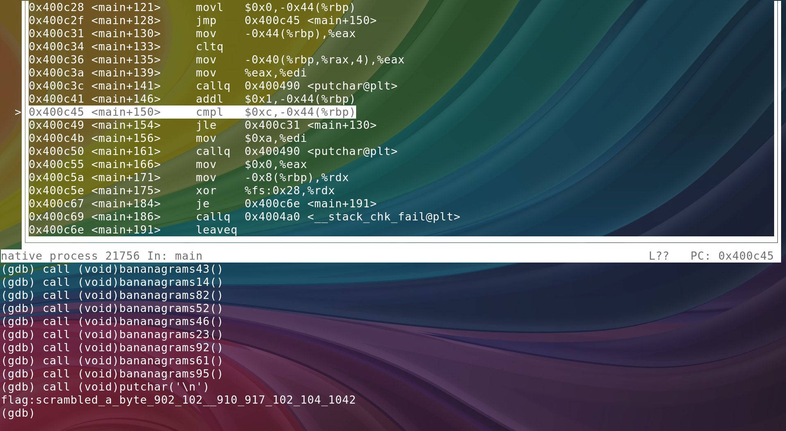
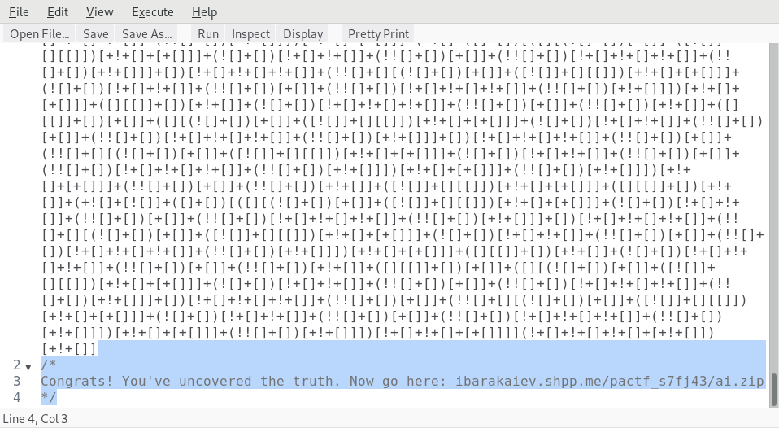

# Doppelgänger — 10
> My friend Miles texted me today with this phrase "МОРЕ РОЕТ АТОМ".
> I first thought that he went insane and has
> schizophasia. Apparently, it makes sense! Even though it doesn’t. So,
> what do you think is digging?
>
> Hint: Consider the case and UTF-8 values of the characters…

This one actually took us until the last hour of the competition to solve.
The letters above are actually Cyrillic characters, and copying it into
Google translate yields "SEA WILL ATOM" or its alternate translation
"SEA DIGS ATOM," so the flag is `sea`.

# Redacted — 10
> ANDOVER, MA— Phillips Academy Capture the Flag releases an
> institution-wide memorandum on the security of PDF documents. For privacy,
> parts of the memo are redacted.
>
> View the memo: [SECURE REDACTED MEMORANDUM](SECURE_REDACTED_COPY.pdf).
>
> Hint: Redaction, huh?

The simplest way that I know of to read the contents of a PDF is to use
`pdftotext`.

```bash
» pdftotext SECURE_REDACTED_COPY.pdf -
PACTF
180 Main Street, Andover MA 01810
contact@pactf.com
pactf.com

MARCH 1ST, 2013
MEMORANDUM ON THE SECURITY OF PDF DOCUMENTS AND REDACTION

Over the past several years, there have been several instances in which a journalist, government
officer, or corporate executive has released an otherwise-secret document with redactions.
Unfortunately, these amateur redactors often do a poor job hiding the data they mean to redact,
and leave themselves vulnerable to even the most trivial exploits.
Indeed, few issues pose as real and present a threat as poorly redacted PDF documents. If you
wish to release a PDF document, be sure to release only an image of the file—that way, you won’t
be vulnerable to leaks.
The flag is `b3_car3ful_0r_y0ur_l3ak_m1ght_l3ak`.

AN OFFICIAL MEMORANDUM OF PACTF 2018

REDACTED COPY
```

# Am I Pwned? — 15
> I was talking on IRC with a guy who tricked me into giving him a
> hash of my password and then said he could hack me! He said I might
> be “pwned”! I know the hashing algorithm is MD5; that’s still
> secure, right?
>
> ... Oh, you want to know whether my password is secure or not?
>
> It doesn’t have any uppercase letters or numbers or punctuation, but
> isn’t six characters still a lot? what he meant by that one. Would
> you be able to hack my password? Here’s the hash:
>
> `eca065fba51916821eb7274c786c67d9`
>
> Hint: The hacker told me that "MD5 is kinda rekt". That sounds bad,
> right? I mean, how long would it take to brute force it...

Before trying to brute force like the hint suggests, it's better to
check a [rainbow table](https://crackstation.net/) for the hash instead.


# It's In, If — 20
> My older brother sent me [this](itsinif.jpg) photo, but I don’t know
> what to make of it.
>
> Hint: What might big brother know?

Again, `exiftool` or `strings` will do the job.

```bash
» exiftool itsinif.jpg | grep _
Stitching Software              : big_brother_is_looking_at_your_photos
```

# Letter to a Machine — 25
> You intercepted a [letter.rar](letter.rar)—but to read it, you have
> to prove that you are not a human. The password is `NOT BAD` + `FACE`.
>
> Hint: I’m sure it’s just coincidence that `BAD` and `FACE` can be spelled
> with just the letters `ABCDEF`...

Robits like hexadecimal better than English.

```c
#include <stdio.h>

int main() {
    printf("%X\n", ~0xbad + 0xface);
    return 0;
}
```

```bash
» ./letter | unrar p letter.rar

UNRAR 5.60 beta 3 freeware      Copyright (c) 1993-2018 Alexander Roshal


Extracting from letter.rar

------ Printing flag.txt

  35%lIZORZaOkWrIuNB

All OK
```

# The Signal and the Noise — 35
> There’s a message in here somewhere! You’ll have to find it yourself.
>
> [Find the needle in the haystack!](haystack.txt)
>
> Hint: There must be something that distinguishes the signal from the
> noise. How could you mark something in a plain text file? All you have
> are Unicode characters...

Each word is marked as a "needle" by a non-printable unicode character. We
can easily find each word using python.

```python
import string

def string_contains_unicode(s):
    return any([c not in string.printable for c in s])

def get_word_containing_unicode(line):
    if not string_contains_unicode(line): return None
    words = []
    for word in line.split():
        if string_contains_unicode(word):
            words += [''.join([c for c in word if c in string.printable])]
    return ''.join(words)

def main():
    with open('haystack.txt') as fp:
        data = fp.read().split('\n')
    print(' '.join([get_word_containing_unicode(line) for line in data
        if string_contains_unicode(line)]))

if __name__ == '__main__':
    main()
```

```bash
» python haystack.py
the flag is in plain sight
```

# Partial Encryption — 40
> You are a military commander. Some poor intern has tried encrypting their
> messages to you. They gave you this string: `4iyNz2zmshrnG09jmws`. Well
> now you’re going to have to spend all afternoon on this...
>
> Hint: They also scribbled the string `its?vIg` at the bottom, and the
> `?` just means I’m not sure what they wrote. Remember to include
> the underscore!

The hint makes me thing it's a vigenere cipher with an underscore appended
to the alphabet, but my attempts at deciphering have been futile.

# Truly Blue? — 45
> I love lots of things about my school, Phillips Academy Andover. But
> most of all, I love its school color: a soothing shade of blue. I
> couldn’t just tell you the hex code for the color; that wouldn’t
> be enough! I think a 128 x 128 PNG file is probably a better method of
> conveying its utter beauty. That’s not suspicious, right? Gaze upon
> its beauty! [True blue](true-blue.png)!
>
> Hint: Did you know there are 16,777,216 possible RGB colors, and only one
> of them is Andover blue? I wonder if you could even tell the difference
> between all of them...

My partner and I solved this one together. Inspecting the image, I saw 8 unique pixel colors:

```
{(1, 49, 156), (0, 49, 157), (0, 49, 156), (0, 48, 157), (1, 48, 156), (0, 48, 156), (1, 48, 157), (1, 49, 157)}
```

As an electrical engineer, I instantly recognized these values as
enumerating binary `000` through `111`. My partner strung the bits
together to find the flag!

The below is my solution based on his description.

```python
from PIL import Image

# get pixels
img = Image.open('true-blue.png')
lut = {
    (0, 48, 156) : 0x0,
    (0, 48, 157) : 0x1,
    (0, 49, 156) : 0x2,
    (0, 49, 157) : 0x3,
    (1, 48, 156) : 0x4,
    (1, 48, 157) : 0x5,
    (1, 49, 156) : 0x6,
    (1, 49, 157) : 0x7,
}
pixels = list(img.getdata())
msg = ''.join(map(lambda x: bin(lut[x])[2:].zfill(3), pixels[:2400]))
print(''.join([chr(int(msg[i:i+8], 2)) for i in range(0, len(msg), 8)]))
```

```bash
» python true-blue.py
Lorem ipsum dolor sit amet, consectetur adipiscing elit. Ut eleifend, metus accumsan accumsanpharetra, dui justo lobortis augue, non bibendum sapien lacus a nulla. Praesent non libero et magnaornare interdum. Vivamus et mi et justo tincidunt porttitor placerat in nisl. Nam mollis quam sitamet iaculis volutpat. Nulla posuere pulvinar est, ac consectetur ex rhoncus non. Vivamus efficitur,ex vel lobortis faucibus, massa neque iaculis libero, eu dictum orci odio ut ante. Phasellus luctusmagna vel euismod cursus. Donec et est rhoncus, lacinia metus in, sodales lectus. Sed posuere, nibhvitae egestas rutrum, nisl odio iaculis urna, et bibendum dolor augue tristique lacus. Ut nuncmetus, blandit a nisl vitae, pulvinar fringilla justo. The flag is "last bitsmatter". Congratulations! You cracked the code! I$I$I$I$I$I$I$I$I$I$I$I$I$I$I$I$I$I$I$I$I$I$I$I$I$I$I$I$I$I$I$
```

# Zip Zap Zop — 45
> My friend gave me [this file](zip-zap-zop.zip), but I have no idea what
> to do with it?
>
> Hint: I tried to make this file really, really small.

My initial inspection reveals that the file is `zlib compressed data`,
so I decompressed it, only to find... more `zlib compressed data`! You
don't have to guess how many times you need to do this.

```bash
#!/bin/bash

FILE=$(mktemp XXXXXXXX)
TMP=$(mktemp XXXXXXXX)

cp zip-zap-zop.zip $FILE
while [[ $(file $FILE) = *zlib* ]]; do
    zlib-flate -uncompress < $FILE > $TMP
    mv -f $TMP $FILE
done
cat $FILE; rm $FILE
```

```bash
» ./zip-zap-zop.sh
}qXflagqX!Gotza_Makes_1T_V_small_1340412689qs.
```

# Reversal 3 2 1 — 50
> I received [this file](source.out) from my bananagrams partners! I think
> they’re just trying to distract me from the game. I need to finish
> this one quick, so I can get back to my game! Any help?
>
> Hint: Who doesn’t like a good game of bananagrams?

After inspecting the assembly and symbol table, there are two parts to
this puzzle we have to put together. The first part is that there are
many, many `bananagramsN` functions where `N` is a number. Most of these
functions do nothing. The other part are these `movl` instructions.

```
  400bcd:       c7 45 c0 24 00 00 00    movl   $0x24,-0x40(%rbp)
  400bd4:       c7 45 c4 05 00 00 00    movl   $0x5,-0x3c(%rbp)
  400bdb:       c7 45 c8 48 00 00 00    movl   $0x48,-0x38(%rbp)
  400be2:       c7 45 cc 2a 00 00 00    movl   $0x2a,-0x34(%rbp)
  400be9:       c7 45 d0 2b 00 00 00    movl   $0x2b,-0x30(%rbp)
  400bf0:       c7 45 d4 0e 00 00 00    movl   $0xe,-0x2c(%rbp)
  400bf7:       c7 45 d8 52 00 00 00    movl   $0x52,-0x28(%rbp)
  400bfe:       c7 45 dc 34 00 00 00    movl   $0x34,-0x24(%rbp)
  400c05:       c7 45 e0 2e 00 00 00    movl   $0x2e,-0x20(%rbp)
  400c0c:       c7 45 e4 17 00 00 00    movl   $0x17,-0x1c(%rbp)
  400c13:       c7 45 e8 5c 00 00 00    movl   $0x5c,-0x18(%rbp)
  400c1a:       c7 45 ec 3d 00 00 00    movl   $0x3d,-0x14(%rbp)
  400c21:       c7 45 f0 5f 00 00 00    movl   $0x5f,-0x10(%rbp)
```

Using `gdb`, I called each `bananagramsN` function using the value from
each `movl` in the order they appear.



Judging from the flag, there is probably a byte that you can change to
have the program print the flag directly.

# Streaming Attack — 50
> A popular `twitch.tv` streamer who goes by `BabblingBrook_PACTF` streams
> her adventures trying to visit a waterfall in every country that has
> one. She doesn’t like attention, so she encrypts her messages to us so
> that people don’t know where she’s heading next. I managed to get a
> copy of the encryption program, and I also managed to get an encrypted
> version of the message `TheCodeSamurai subscribed for 3 months! Thank
> you, TheCodeSamurai!` sent to me by subscribing. Here’s the message
> (in hexadecimal):
>
> ```
> C1D7B5D06DD88D0F894E592B0A5FDB93C4F151C04BC2540D8626E5B0017D604E33ABC51334662B8ED8CCADE9B039AE4FB5F363EA9EDD32D551C32A892B058CDE8B0B
> ```
>
> Now, I want to decrypt the following message. Any way of helping me out?
>
> ```
> F4E0A7F276D99A3A894F40060245A48AC4E056FC58F4451C9063E2B22C323D3137B0D8382F7C6ECB
> ```
>
> [Here’s the encryption program; you’ll need it](encryptor).
>
> Hint: BabblingBrook_PACTF is a nice person, but I don’t think she’s
> super good at cryptography. Any way you could exploit that fact?

I really enjoyed solving this one. For starters, you actually don't
*need* the encryption program, although it does confirm the same key is
being used to generate the stream.

This challenge is very simple if you know how stream ciphers work and
that they are vulnerable if the key is reused. Suppose `A` and `B`
are plaintext messages of the same length. The encryption function is
simply the plaintext message `xor`ed with the stream `C(K)`.

```
E(A, K) = A xor C(K)
E(B, K) = B xor C(K)

E(A, K) xor E(B, K) = A xor B xor C(K) xor C(K)
                    = A xor B
```

Pretty simple, but very powerful. So we are given `A`, `E(A, K)`, `E(B, K)`,
and we are looking for `B`.

```
E(A, K) xor E(B, K)       = A xor B
E(A, K) xor E(B, K) xor A = A xor B xor A
E(A, K) xor E(B, K) xor A = B
```

Using the above equations, we can find `B` by simply `xor`ing everything
we are given!

```python
def convert_to_bytes(s, n=2):
    return ''.join([chr(int(s[i:i+n], 16)) for i in range(0, len(s), n)])
def str_xor(s1, s2):
    return ''.join([chr(ord(c1) ^ ord(c2)) for (c1,c2) in zip(s1,s2)])

a = 'TheCodeSamurai subscribed for 3 months! Thank you, TheCodeSamurai!'
e_a = convert_to_bytes('C1D7B5D06DD88D0F894E592B0A5FDB93C4F151C04BC2540D8626E5B0017D604E33ABC51334662B8ED8CCADE9B039AE4FB5F363EA9EDD32D551C32A892B058CDE8B0B')
e_b = convert_to_bytes('F4E0A7F276D99A3A894F40060245A48AC4E056FC58F4451C9063E2B22C323D3137B0D8382F7C6ECB')

print(str_xor(str_xor(e_a, e_b), a))
```

```bash
» python streaming-attack.py
a_waterfall_is_just_a_stream_on_its_side
```

# Victor — 50
> Привет, меня зовут Рейно, иначе известный как Виктор. Пожалуйста,
> расшифруйте это секретное сообщение - у меня нет времени для этого. Я
> предоставляю вам ключ.
>
> *Note: the flag contains Cyrillic characters.*
>
> [необходимая информация](key.png)
>
> Hint: Google Translate is your friend—but you might want to familiarize yourself with Russian Nihilism, too.

# Wakanda problem is this? — 60
> You’ve arrived at Wakanda’s border. Only the flag will allow you to
> enter. [This is all you have](gate.jpg).
>
> Hint: Use the bytes in the second image.

Judging from the hint, there are images hidden within this image. I use
`binwalk` to extract them, followed by `strings` in the second image to
get the flag.

```bash
» binwalk -D 'zip' gate.jpg

DECIMAL       HEXADECIMAL     DESCRIPTION
--------------------------------------------------------------------------------
0             0x0             JPEG image data, JFIF standard 1.01
30148         0x75C4          Zip archive data, at least v2.0 to extract, compressed size: 22399, uncompressed size: 22455, name: blackpanther1.jpg
52594         0xCD72          Zip archive data, at least v2.0 to extract, compressed size: 22400, uncompressed size: 22455, name: blackpanther2.jpg
75167         0x1259F         End of Zip archive

» unzip _gate.jpg.extracted/75C4
Archive:  _gate.jpg.extracted/75C4
  inflating: blackpanther1.jpg
  inflating: blackpanther2.jpg
» strings blackpanther2.jpg | grep -i flag
flag{wakanda4eva}
```

# Library of Babel — 75
> Is [this](babel.mp4) what passes through fiber optic cables? Must be...
>
> Hint: It is much faster to extract frames from the video and write a script!

I was only able to get partway through this problem. Converting the
video to frames, and then qr decoding them was pretty simple.

```bash
» mkdir frames
» ffmpeg -i video.mp4 frames/frame%03d.bmp
» zbarimg frames/frame* > library.txt
» cat library.txt
# only showing relevant portion
=== YOUR ANSWER IS HERE ===
"eqvzb" w-3, s-5, v-25, p-248
22syz7u9dogitfxlezobhobeuno6pnec20n6bqfg22cqihe41hbbi8aut4t618oj4wee4to32mdfmmsykl76r002hfbsurum4rr6tprxi4yinrzlqee17y5sfw11k5ybxsie6icu2x6fxvbq2wskzjtmng31ejzfikwj9ql0nxutriwr6p6vqzpdl1thkgt0o4is7znam
9xub632v5mi39t8oae98kv5faatt11zitxmuka8qdrhbyw02i89fx9desufb6giwvgsvgrd18925zrgrqai31l92i6qplb9embayx8gmhqczl4gi9mb112plzs78w38hhbqmximi718hte6tw6b2m42xfwh3nnby2jemn0sz80hevqccfpyqd674swckdyaaptdp482x25uanhh5q8r0xqtokgwb8lbn41vl4mhhfvoeippvnl1t3ojshstgwumk48q8l3m937sou6b1838u7pie8da6gh8d8q5e09vazbdpsbtwyu35we0vu1r9cxfs
aeisivqa01nrols0xculnijghh4goztt2ymrt2h54hfbg8o5w03ai9ghobywjxxd8erazpyjisdnrehi3xvh6yz6gnynrsgbzek9uv2poyrdld0quk3cxj1cf8z2a4jbzucqcivwvkoh9uaecnlgqpzwy6bmraynt9rl7mbpob449swf3nf3010o0uvweo0ty0jqshf4xzvxtmuhq5uutoyijqrra4lehasyeokf0wrdhcysxj8xyt8uc6uywmya3i8ipx9g2dha1lax1l3vzorv99qkqugxixa17pi1xua3o7z5qehlvctz6cdgef2z
wleaaeyvlqn0m3hdczmgw26irn6bi0oy03k0it3hmekyxrrbmr73kokpitl1lpndke593dw5kdmp0ahjpcd191asr9ametpiks1a1rwnool8raisalbvwu0k04mjywmdwmcpn7m5nsrw505tgfv9k2708uc6syeur2f9zgqp9z35c6eu55bh4leal9ow95dpy77dtu6wu9cybq58bhdkthl0m85ekoeh8xvckpa7l6uz5vgyl0nbt3ole1hc4l4wtplgddtkulbds7egyp8nk2tf26t6kg7lunqwxm83b8m6mynhjdfxgnns8l3j2v2n
ku5z1auibmmc2x83013aqvor4teasklqkywhxdjjxrz2jbwwkqu6jed9gn83mxsg5ppzz9w0kschteeukmoic28wqq1pldsjlzmfptu3aod17o7gbeteenilm4pplg6yr0m0he7odgmq9pb17v9bekfllcbu8djj5e3e0uklethkcrmqr7q35avf1xpsvy5fod6ub2ra1awtoqbo26u2ydmkbotp4wuuwx3201so0gfhjs37bss3410780rqbke58loyad0xlldz4eunjezj769hm9jn1f6ne1lmrokw4l36v6w2tyf8z5f2mp2vqbht
kspnfeukopw3q3mnpk4gxsekj3wv2gl85yhu37og2qhu027fz1c4xq3jvc2q8szqi2b3rwdykfq50ii8nct0rh8apgpdin6w674khok0551tr6v1wrevoje3v823263in5atvkwn9gbcfjr3yy64ncyuo5q48rghc73uiak27e3od8ipzs2k2ojxl6a1exvdcyv3y2fu3j0wmnqbdxcwrvysyz43a1lhzm6t4mzkeciqg4j81w3q9i7vch81nc6c663r20iwek4cd3dk2qyizivbk3yfcrcsyy17p30jmwp2u1ogjpbw6ckjrzd5z8qa
b61vjq98hwhiua5qb8kvkp1datpqoxxh286k3mu6uhauv95nhajs5sf3j3f7xyvgz0d2omk4ro1umbqzjs5i4lyhns35sqm1u6sycfkeu2po70dgsoy5abl7csfvwjovz05pp338pnkx7dfvz952utwpiyxx261rolsm1eqc8mvmhw3e2o6adxdwdnjn1vxorfgm65rx20ztnc80nwmfcgbql87bz805xvb4lfq3lsnguvw4a13jqroa6xjhvnnb514qp9jgeytmduc95t5eqbuu3yqtps6bhn0nhsr2qmbtrjf609yx2n5a8k8hns6g
ox0tjq26wtn9arjsrige2is9e6v56fa62x3nynnnsbri6gbf3e2pituvua6i9z6kc4brf9f671e2zoa6t9f1ix1akwl5jp51tcadyswwot7g7125hct72h5hnctytcen6gc0qcsgl31xpb5bs5qw59v9wzu7eba6sr3trwstiioj7og6y2h69x3vy502ei1gnjchmfhl65jd02mhdinzzv55rl2w8u1uxoiofzt89lbqre1pq8kwyo28cg6296llkfpmlaak16httutriqn9bitfrh2p1vr6htuzjxiif4ss5m601kris67x04ni7g5e
b6dpdiqmwb6yx0mtaj8pccww27bom5lwnxpuow6kg7e7wag7w0pfp50349pm9qdr550a9wc0dbfr2v3ezmrvbdwjvu7tu59i8odas8i29rmimjj7h3ga5ox0d50n1vwaq06c5o5pm2emokprk3xi7x25af8nayygnwvynl3863vxo6w0qke1yywr2fk42xcecymirqzfxhl967hbw89v44pschg8bw0cod5fx0s7cmi3vihlelu0b0pmselqozqz2g23285gec4zqfq86b7ut3aqr8ofi1m1f2u193fxixirtco0hhstcla8rkhgcl04
mpjfefyti9ka86scfpb74stomed4maim6b329d91x1oonkkbqm9kjd6xl57v1zhesz3or8nofup3esvux980b3zwstulip20ug3hrh18pc3sgfnnjt65x697t1n22jef31s9rulfk9ad6qmd12ytyybxkikq98frkg434q4quvzvte9z6376hgt880zh0ly4gtopdc8jg3c7w534oezei8ytlj8qfliccuv1h2profbor9rbn78tp3jw5ww4xzc2rq8hg14wkss2tlr6xve62u256ohwfv8xd6i9wwn3jztv7cit60m2ui0d2xnj7k5b
tza5upm81efq4ymwewuzvru6qsavg1w50n0joic98sejzdo3kieunrzxm9wku7i4011z21mgfydsc4h4vfhjf73tnv3obko3irds88mwyu5yr77qy1urkvnoet03nv6oso9s7gyn0fz0t9600niaa46cf9wmp7yaj84r8s1tp35im
=== YOUR ANSWER IS HERE ===
```

The next step confused me a bit. I first thought `"eqvzb" w-3,
s-5, v-25, p-248` would lead me to the flag in the [Library of
Babel](http://libraryofbabel.info/). My mistake was thinking `eqvzb`
was a hexagon, when in fact it is the title of the entry we
need. Searching for such a short title wouldn't work, however. What
could we use the other 3256 characters in the answe rsection for? What's
that? A hexagon can have 3260 characters? Yup! The answer is in:

```
hexagon:    22syz7u9dogitfxlezobhobeuno6pnec20n6bqfg22cqihe41hbbi8aut4t618oj4wee4to32mdfmmsykl76r002hfbsurum4rr6tprxi4yinrzlqee17y5sfw11k5ybxsie6icu2x6fxvbq2wskzjtmng31ejzfikwj9ql0nxutriwr6p6vqzpdl1thkgt0o4is7znam9xub632v5mi39t8oae98kv5faatt11zitxmuka8qdrhbyw02i89fx9desufb6giwvgsvgrd18925zrgrqai31l92i6qplb9embayx8gmhqczl4gi9mb112plzs78w38hhbqmximi718hte6tw6b2m42xfwh3nnby2jemn0sz80hevqccfpyqd674swckdyaaptdp482x25uanhh5q8r0xqtokgwb8lbn41vl4mhhfvoeippvnl1t3ojshstgwumk48q8l3m937sou6b1838u7pie8da6gh8d8q5e09vazbdpsbtwyu35we0vu1r9cxfsaeisivqa01nrols0xculnijghh4goztt2ymrt2h54hfbg8o5w03ai9ghobywjxxd8erazpyjisdnrehi3xvh6yz6gnynrsgbzek9uv2poyrdld0quk3cxj1cf8z2a4jbzucqcivwvkoh9uaecnlgqpzwy6bmraynt9rl7mbpob449swf3nf3010o0uvweo0ty0jqshf4xzvxtmuhq5uutoyijqrra4lehasyeokf0wrdhcysxj8xyt8uc6uywmya3i8ipx9g2dha1lax1l3vzorv99qkqugxixa17pi1xua3o7z5qehlvctz6cdgef2zwleaaeyvlqn0m3hdczmgw26irn6bi0oy03k0it3hmekyxrrbmr73kokpitl1lpndke593dw5kdmp0ahjpcd191asr9ametpiks1a1rwnool8raisalbvwu0k04mjywmdwmcpn7m5nsrw505tgfv9k2708uc6syeur2f9zgqp9z35c6eu55bh4leal9ow95dpy77dtu6wu9cybq58bhdkthl0m85ekoeh8xvckpa7l6uz5vgyl0nbt3ole1hc4l4wtplgddtkulbds7egyp8nk2tf26t6kg7lunqwxm83b8m6mynhjdfxgnns8l3j2v2nku5z1auibmmc2x83013aqvor4teasklqkywhxdjjxrz2jbwwkqu6jed9gn83mxsg5ppzz9w0kschteeukmoic28wqq1pldsjlzmfptu3aod17o7gbeteenilm4pplg6yr0m0he7odgmq9pb17v9bekfllcbu8djj5e3e0uklethkcrmqr7q35avf1xpsvy5fod6ub2ra1awtoqbo26u2ydmkbotp4wuuwx3201so0gfhjs37bss3410780rqbke58loyad0xlldz4eunjezj769hm9jn1f6ne1lmrokw4l36v6w2tyf8z5f2mp2vqbhtkspnfeukopw3q3mnpk4gxsekj3wv2gl85yhu37og2qhu027fz1c4xq3jvc2q8szqi2b3rwdykfq50ii8nct0rh8apgpdin6w674khok0551tr6v1wrevoje3v823263in5atvkwn9gbcfjr3yy64ncyuo5q48rghc73uiak27e3od8ipzs2k2ojxl6a1exvdcyv3y2fu3j0wmnqbdxcwrvysyz43a1lhzm6t4mzkeciqg4j81w3q9i7vch81nc6c663r20iwek4cd3dk2qyizivbk3yfcrcsyy17p30jmwp2u1ogjpbw6ckjrzd5z8qab61vjq98hwhiua5qb8kvkp1datpqoxxh286k3mu6uhauv95nhajs5sf3j3f7xyvgz0d2omk4ro1umbqzjs5i4lyhns35sqm1u6sycfkeu2po70dgsoy5abl7csfvwjovz05pp338pnkx7dfvz952utwpiyxx261rolsm1eqc8mvmhw3e2o6adxdwdnjn1vxorfgm65rx20ztnc80nwmfcgbql87bz805xvb4lfq3lsnguvw4a13jqroa6xjhvnnb514qp9jgeytmduc95t5eqbuu3yqtps6bhn0nhsr2qmbtrjf609yx2n5a8k8hns6gox0tjq26wtn9arjsrige2is9e6v56fa62x3nynnnsbri6gbf3e2pituvua6i9z6kc4brf9f671e2zoa6t9f1ix1akwl5jp51tcadyswwot7g7125hct72h5hnctytcen6gc0qcsgl31xpb5bs5qw59v9wzu7eba6sr3trwstiioj7og6y2h69x3vy502ei1gnjchmfhl65jd02mhdinzzv55rl2w8u1uxoiofzt89lbqre1pq8kwyo28cg6296llkfpmlaak16httutriqn9bitfrh2p1vr6htuzjxiif4ss5m601kris67x04ni7g5eb6dpdiqmwb6yx0mtaj8pccww27bom5lwnxpuow6kg7e7wag7w0pfp50349pm9qdr550a9wc0dbfr2v3ezmrvbdwjvu7tu59i8odas8i29rmimjj7h3ga5ox0d50n1vwaq06c5o5pm2emokprk3xi7x25af8nayygnwvynl3863vxo6w0qke1yywr2fk42xcecymirqzfxhl967hbw89v44pschg8bw0cod5fx0s7cmi3vihlelu0b0pmselqozqz2g23285gec4zqfq86b7ut3aqr8ofi1m1f2u193fxixirtco0hhstcla8rkhgcl04mpjfefyti9ka86scfpb74stomed4maim6b329d91x1oonkkbqm9kjd6xl57v1zhesz3or8nofup3esvux980b3zwstulip20ug3hrh18pc3sgfnnjt65x697t1n22jef31s9rulfk9ad6qmd12ytyybxkikq98frkg434q4quvzvte9z6376hgt880zh0ly4gtopdc8jg3c7w534oezei8ytlj8qfliccuv1h2profbor9rbn78tp3jw5ww4xzc2rq8hg14wkss2tlr6xve62u256ohwfv8xd6i9wwn3jztv7cit60m2ui0d2xnj7k5btza5upm81efq4ymwewuzvru6qsavg1w50n0joic98sejzdo3kieunrzxm9wku7i4011z21mgfydsc4h4vfhjf73tnv3obko3irds88mwyu5yr77qy1urkvnoet03nv6oso9s7gyn0fz0t9600niaa46cf9wmp7yaj84r8s1tp35im
wall:       3
shelf:      5
volume:     25
page:       248
```

[Link](https://libraryofbabel.info/book.cgi?22syz7u9dogitfxlezobhobeuno6pnec20n6bqfg22cqihe41hbbi8aut4t618oj4wee4to32mdfmmsykl76r002hfbsurum4rr6tprxi4yinrzlqee17y5sfw11k5ybxsie6icu2x6fxvbq2wskzjtmng31ejzfikwj9ql0nxutriwr6p6vqzpdl1thkgt0o4is7znam9xub632v5mi39t8oae98kv5faatt11zitxmuka8qdrhbyw02i89fx9desufb6giwvgsvgrd18925zrgrqai31l92i6qplb9embayx8gmhqczl4gi9mb112plzs78w38hhbqmximi718hte6tw6b2m42xfwh3nnby2jemn0sz80hevqccfpyqd674swckdyaaptdp482x25uanhh5q8r0xqtokgwb8lbn41vl4mhhfvoeippvnl1t3ojshstgwumk48q8l3m937sou6b1838u7pie8da6gh8d8q5e09vazbdpsbtwyu35we0vu1r9cxfsaeisivqa01nrols0xculnijghh4goztt2ymrt2h54hfbg8o5w03ai9ghobywjxxd8erazpyjisdnrehi3xvh6yz6gnynrsgbzek9uv2poyrdld0quk3cxj1cf8z2a4jbzucqcivwvkoh9uaecnlgqpzwy6bmraynt9rl7mbpob449swf3nf3010o0uvweo0ty0jqshf4xzvxtmuhq5uutoyijqrra4lehasyeokf0wrdhcysxj8xyt8uc6uywmya3i8ipx9g2dha1lax1l3vzorv99qkqugxixa17pi1xua3o7z5qehlvctz6cdgef2zwleaaeyvlqn0m3hdczmgw26irn6bi0oy03k0it3hmekyxrrbmr73kokpitl1lpndke593dw5kdmp0ahjpcd191asr9ametpiks1a1rwnool8raisalbvwu0k04mjywmdwmcpn7m5nsrw505tgfv9k2708uc6syeur2f9zgqp9z35c6eu55bh4leal9ow95dpy77dtu6wu9cybq58bhdkthl0m85ekoeh8xvckpa7l6uz5vgyl0nbt3ole1hc4l4wtplgddtkulbds7egyp8nk2tf26t6kg7lunqwxm83b8m6mynhjdfxgnns8l3j2v2nku5z1auibmmc2x83013aqvor4teasklqkywhxdjjxrz2jbwwkqu6jed9gn83mxsg5ppzz9w0kschteeukmoic28wqq1pldsjlzmfptu3aod17o7gbeteenilm4pplg6yr0m0he7odgmq9pb17v9bekfllcbu8djj5e3e0uklethkcrmqr7q35avf1xpsvy5fod6ub2ra1awtoqbo26u2ydmkbotp4wuuwx3201so0gfhjs37bss3410780rqbke58loyad0xlldz4eunjezj769hm9jn1f6ne1lmrokw4l36v6w2tyf8z5f2mp2vqbhtkspnfeukopw3q3mnpk4gxsekj3wv2gl85yhu37og2qhu027fz1c4xq3jvc2q8szqi2b3rwdykfq50ii8nct0rh8apgpdin6w674khok0551tr6v1wrevoje3v823263in5atvkwn9gbcfjr3yy64ncyuo5q48rghc73uiak27e3od8ipzs2k2ojxl6a1exvdcyv3y2fu3j0wmnqbdxcwrvysyz43a1lhzm6t4mzkeciqg4j81w3q9i7vch81nc6c663r20iwek4cd3dk2qyizivbk3yfcrcsyy17p30jmwp2u1ogjpbw6ckjrzd5z8qab61vjq98hwhiua5qb8kvkp1datpqoxxh286k3mu6uhauv95nhajs5sf3j3f7xyvgz0d2omk4ro1umbqzjs5i4lyhns35sqm1u6sycfkeu2po70dgsoy5abl7csfvwjovz05pp338pnkx7dfvz952utwpiyxx261rolsm1eqc8mvmhw3e2o6adxdwdnjn1vxorfgm65rx20ztnc80nwmfcgbql87bz805xvb4lfq3lsnguvw4a13jqroa6xjhvnnb514qp9jgeytmduc95t5eqbuu3yqtps6bhn0nhsr2qmbtrjf609yx2n5a8k8hns6gox0tjq26wtn9arjsrige2is9e6v56fa62x3nynnnsbri6gbf3e2pituvua6i9z6kc4brf9f671e2zoa6t9f1ix1akwl5jp51tcadyswwot7g7125hct72h5hnctytcen6gc0qcsgl31xpb5bs5qw59v9wzu7eba6sr3trwstiioj7og6y2h69x3vy502ei1gnjchmfhl65jd02mhdinzzv55rl2w8u1uxoiofzt89lbqre1pq8kwyo28cg6296llkfpmlaak16httutriqn9bitfrh2p1vr6htuzjxiif4ss5m601kris67x04ni7g5eb6dpdiqmwb6yx0mtaj8pccww27bom5lwnxpuow6kg7e7wag7w0pfp50349pm9qdr550a9wc0dbfr2v3ezmrvbdwjvu7tu59i8odas8i29rmimjj7h3ga5ox0d50n1vwaq06c5o5pm2emokprk3xi7x25af8nayygnwvynl3863vxo6w0qke1yywr2fk42xcecymirqzfxhl967hbw89v44pschg8bw0cod5fx0s7cmi3vihlelu0b0pmselqozqz2g23285gec4zqfq86b7ut3aqr8ofi1m1f2u193fxixirtco0hhstcla8rkhgcl04mpjfefyti9ka86scfpb74stomed4maim6b329d91x1oonkkbqm9kjd6xl57v1zhesz3or8nofup3esvux980b3zwstulip20ug3hrh18pc3sgfnnjt65x697t1n22jef31s9rulfk9ad6qmd12ytyybxkikq98frkg434q4quvzvte9z6376hgt880zh0ly4gtopdc8jg3c7w534oezei8ytlj8qfliccuv1h2profbor9rbn78tp3jw5ww4xzc2rq8hg14wkss2tlr6xve62u256ohwfv8xd6i9wwn3jztv7cit60m2ui0d2xnj7k5btza5upm81efq4ymwewuzvru6qsavg1w50n0joic98sejzdo3kieunrzxm9wku7i4011z21mgfydsc4h4vfhjf73tnv3obko3irds88mwyu5yr77qy1urkvnoet03nv6oso9s7gyn0fz0t9600niaa46cf9wmp7yaj84r8s1tp35im-w3-s5-v25:248)

# AI — 80
> Our artificial intelligence engineer made a groundbreaking discovery,
> but left the company unexpectedly... all we have is the obfuscated
> [source.txt](source.txt)...
>
> Hint: What language thinks 3 + '3' == "33"?

The obfuscated source is infamously `javascript` code. Running it using
Firefox's Scratchpad shows a zip file to download.



Inside the zip directory is a javascript file containing another link
to download. This time we have to implement a very simple function
`get_key_number`. The challenge is below.

```
» curl ibarakaiev.shpp.me/pactf_s7fj43/ai.zip > ai.zip
» unzip ai.zip
Archive:  ai.zip
   creating: ai/
   creating: ai/assets/
   creating: ai/assets/css/
  inflating: ai/assets/css/style.css
   creating: ai/assets/img/
  inflating: ai/assets/img/background.jpg
  inflating: ai/assets/img/dog_picture.jpg
  inflating: ai/assets/img/not_dog_picture.jpg
   creating: ai/assets/js/
  inflating: ai/assets/js/baffle.min.js
  inflating: ai/assets/js/script.js
  inflating: ai/assets/js/typed.js
  inflating: ai/index.html
» tail -60 ai/assets/js/script.js

// be careful when changing stupid to false or it can produce the key!!!
function launch_artificial_intelligence(stupid) {
    $('.right').animate({
        'background-color': 'rgba(255, 255, 255, 0.75)'
    }, 200);
    $('#header_text').html('Artificial Intelligence');

    if (stupid) {
        setTimeout(function() {
            append_ai('Hi, I can recognize dogs!<br><br>', 100, 300);
            setTimeout(function() {
                $("#dog_container").fadeIn('fast');
                setTimeout(function() {
                    $("#cat_container").fadeIn('fast');
                }, 1500)
            }, 2500);
        }, 100);
    } else {
        setTimeout(function() {
            append_ai('Hi. ', 100, 300)
            setTimeout(function() {
                append_ai('I exploited weaknesses of Facebook to access everybody\'s information...', 50, 300)
                setTimeout(function() {
                    append_ai(' Actually I just asked Mark and he sold it.', 40, 300);
                    setTimeout(function() {
                        append_ai(' Oh well.<br><br>', 40, 300);
                        setTimeout(function() {
                            append_ai('Turned out the most discussed topic was... <br><br>', 40, 300)
                            setTimeout(function() {
                                append_ai('CATS<br><br>', 30, 3000);
                                setTimeout(function() {
                                    append_ai('But that\'s not the key. ', 30, 300);
                                    setTimeout(function() {
                                        append_ai('The key is now stored securely in ("http://ibarakaiev.shpp.me/pactf_s7fj43/key_%d.txt", get_key_number(6, [16, 23, 16, 15, 42, 8])).', 30, 300);
                                    }, 1800)
                                }, 6000)
                            }, 1800)
                        }, 2000);
                    }, 2000);
                }, 3000);
            }, 1800);
        }, 300);
    }
}

// this function returns the number needed to access key_%d.txt
function get_key_number(n, arr) {
    // TODO: implement solution to the following problem

    /**
     * You are given a sequence _s_ consisting of _N_ integers. You can divide it to
     * two sequences _p_ and _q_ such that every element of your sequence belongs exactly
     * to one of these sequences.
     *
     * Let _B_ be the sum of elements belonging to _p_, and _C_ be the sum of elements
     * belonging to _C_. Note: if some of the sequences is empty then its sum is 0).
     * What is the maximum possible value of _B_ - _C_
     */
}
```

As my partner pointed out, the solution is simply put all the positive
values in `_p_` and all the negative values in `_q_`. For the given list,
the answer is `120`, giving us the URL `http://ibarakaiev.shpp.me/pactf_s7fj43/key_120.txt`.

```bash
curl http://ibarakaiev.shpp.me/pactf_s7fj43/key_120.txt | tee key_120.txt
But you'll have to decrypt it first! The following text is displayed using byfes (it's like bytes but only 5 bits).

mrxwozAp

PACTFSCII is as follows (it's like ASCII but for PACTF). PACTF system only accepts ASCII characters, however.
0  - a
1  - b
2  - c
3  - d
4  - e
5  - f
6  - g
7  - h 
8  - i 
9  - j
10 - k
11 - l
12 - m
13 - n
14 - o
15 - p
16 - q
17 - r
18 - s
19 - t
20 - u
21 - v
22 - w
23 - x
24 - y
25 - z
26 - P
27 - A
28 - C
29 - T
30 - F
31 - \0
```

Yup, another puzzle!

```python
>>> import string
>>> cipher = 'mrxwozAp'
>>> alph = string.ascii_lowercase + 'PACTF'
>>> binary = ''.join([bin(alph.index(c))[2:].zfill(5) for c in cipher])
>>> ''.join([chr(int(''.join(binary[i:i+8]), 2)) for i in range(0, len(binary), 8)])
'doggo'
```

# Hash Master — 90
> Miles forgot his login for OPENWI:RE, so he asked Darcy to send a password
> reset. Instead, she gave him the hash of his password—and the custom
> hashing algorithm. Miles doesn’t have great password security, so you
> could probably brute force it… but maybe there’s a way to do this
> more efficiently?
>
> Here is the hash of Miles' password: `293366475`
>
> Here is the hashing algorithm:
>
> ```
> def hash_it(string):
>     q = 0
>     z = 127
>     for i in [int(byte) for byte in bytearray(string, "utf-8")]:
>         q += i
>         z *= i
>     return (((q << 3)+1)*z) % (2**32 - 1)
> ```
>
> Hint: Okay, OPENWI:RE isn’t part of this problem. But you should still
> subscribe! If you’re interested in what else the PACTF team has been
> working on individually, check out Miles' personal site and Igor’s
> IcyBounce. Alex has been doing some cool things too.
>
> Oh, by the way, Miles' shift keys don’t work—and he's not a big fan of numbers.

I brute forced it.

```python
import itertools as it
import sys
import string

def hash_it(string):
    q = 0
    z = 127
    for i in [int(byte) for byte in bytearray(string, "utf-8")]:
        q += i
        z *= i
    return (((q << 3)+1)*z) % (2**32 - 1)

class unique_element:
    def __init__(self,value,occurrences):
        self.value = value
        self.occurrences = occurrences

def perm_unique(elements):
    eset=set(elements)
    listunique = [unique_element(i,elements.count(i)) for i in eset]
    u=len(elements)
    return perm_unique_helper(listunique,[0]*u,u-1)

def perm_unique_helper(listunique,result_list,d):
    if d < 0:
        yield tuple(result_list)
    else:
        for i in listunique:
            if i.occurrences > 0:
                result_list[d]=i.value
                i.occurrences-=1
                for g in  perm_unique_helper(listunique,result_list,d-1):
                    yield g
                i.occurrences+=1

if __name__ == '__main__':
    hash = 293366475
    guesses = [''.join(x) for x in it.combinations_with_replacement(string.ascii_lowercase, 6)]
    for guess in guesses:
        for g in perm_unique(guess):
            g = ''.join(g)
            h = hash_it(g)
            if h == hash:
                print(g)
                sys.exit(0)

    sys.exit(1)
```

```bash
» python hash-master.py
baaaaa
```

# Skywriting — 100
> If you’ve been having a tough time with these problems, frustration
> can cloud your judgment. To fix that, try jamming out to some music to
> help you find the silver lining. Here, I’ll even give you some to try:
>
> [External Google Drive Link](cumulonimbus.zip)
>
> Hint: The bit of music you hear in that link up above is from a guy who
> goes by insaneintherainmusic on the Internet. He does cool jazzy covers
> of video game music, and he kindly let us use his cover of Gusty Garden
> Galaxy for this problem. Go check out more of his stuff if you like the
> little taste you get here!
